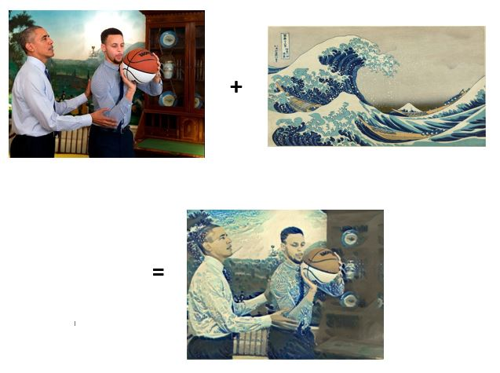

# Neural-Style-Transfer
Creating Art from Images Using Convolutional Neural Network

Neural style transfer is a technique that uses neural networks to generate new images by combining the content of one image with the style of another. The process involves taking a content image and a style image, and using a pre-trained convolutional neural network to extract the content and style features of both images. The content features are then combined with the style features to produce a new image that preserves the content of the original image while adopting the style of the other image.

***
Sytle transfer of an image of a baby dragon and the ship wreckage of the Minotaur

***
Sytle transfer of an image of President Obama and my favorite basketball player, Steph Curry, with an image of The Great Wave off Kanagawa

***
Credit to Udacity Data Science Nanodegree for the knoweldge and for the data
